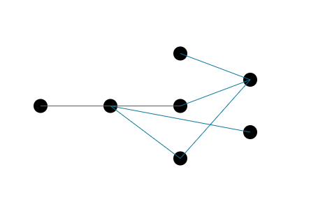

# Graph
Layout algorithm for Directed Acyclic Graph

```
var nodes = [{}, {}, {}, {}, {}, {}, {}];
var edges = [
    { source: 0, target: 1 },
    { source: 0, target: 2 },
    { source: 1, target: 3 },
    { source: 1, target: 4 },
    { source: 2, target: 6 },
    { source: 3, target: 6 },
    { source: 5, target: 6 }
];

setLocations(nodes, edges, layerWidth = 100, rowHeight = 75);
```


## How it Works
It splits the graph into equally-spaced left-to-right layers, then from an initial assignment, it will relocate nodes to the average y-coordinate of its neighbors.

This process is repeated until a number of iterations is complete or there are no more changes. Once the changes have stopped, nodes are relocated to be equally spaced, but keeping the new ordering.
